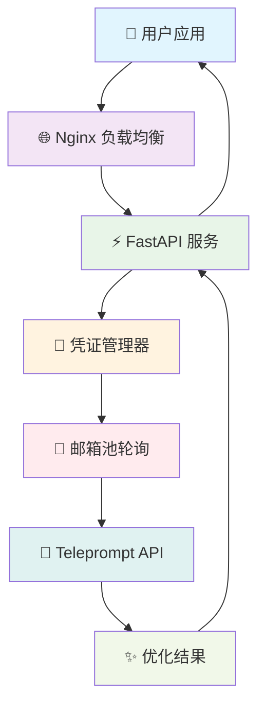
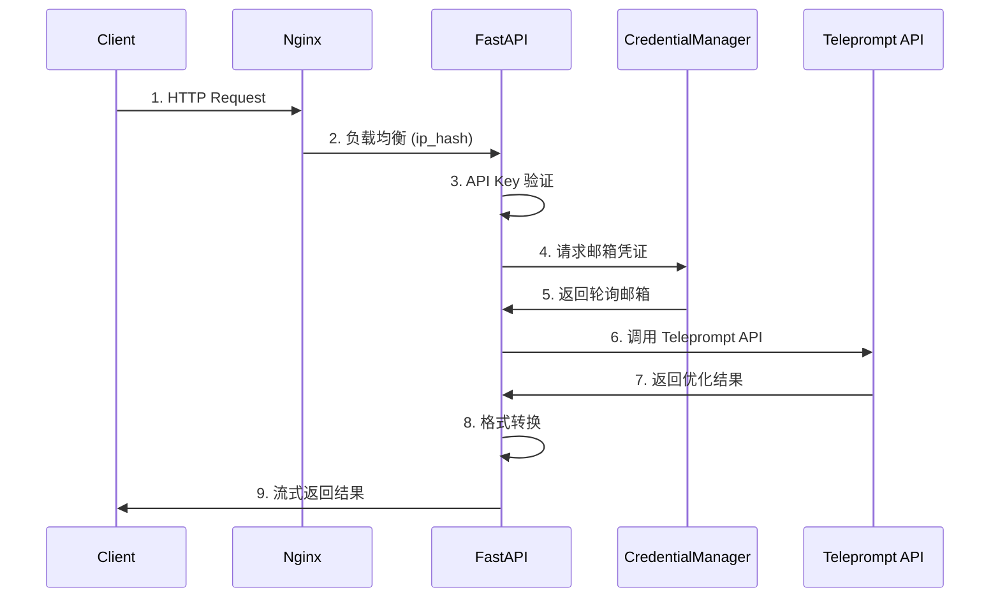

# teleprompt-2api 🚀 - 你的私人提示词优化魔法师

<div align="center">


**中文** | [English](README.en.md) 📖

> "我们站在巨人的肩膀上，不是为了看得更远，而是为了成为新的巨人，让后来者站得更高。开源，就是分享我们攀登的阶梯。" - 一位无名的代码诗人

[](https://render.com/deploy?repo=https://github.com/lzA6/teleprompt-2api)

</div>

## ✨ 项目简介

`teleprompt-2api` 是一个革命性的开源项目！🧙‍♂️ 它将强大的 [Teleprompt](https://app.teleprompt.io/prompt-optimizer) 提示词优化功能，封装成完全兼容 **OpenAI 格式** 的 API 接口。

### 🎯 这意味着什么？

你可以将任何支持 OpenAI API 的应用无缝对接到这个服务上：

- 🖥️ **ChatGPT-Next-Web** - 让你的对话更智能
- 💬 **LobeChat** - 优化每次交互的提示词  
- 🔧 **自定义 AI 工具** - 集成提示词优化能力
- 📝 **写作助手** - 自动优化创作提示
- 💻 **编程助手** - 提升代码生成质量

---

## 🚀 核心特性

<div align="center">



</div>

| 特性 | 描述 | 状态 |
|------|------|------|
| 🤖 **OpenAI 格式兼容** | 无缝集成现有 AI 应用生态 | ✅ 已实现 |
| 👥 **多账号智能轮询** | 自动切换多个邮箱账号，提高稳定性 | ✅ 已实现 |
| 🚀 **一键部署** | 支持 Docker、Render 等平台快速部署 | ✅ 已实现 |
| ⚡ **高性能架构** | FastAPI + Uvicorn 异步处理 | ✅ 已实现 |
| 🛡️ **API 密钥保护** | 安全的访问控制机制 | ✅ 已实现 |
| 🌊 **流式响应** | 兼容 OpenAI 流式输出格式 | ✅ 已实现 |

---

## 🎯 适用场景

### 🤔 你是否遇到过这些问题？

| 用户类型 | 痛点场景 | teleprompt-2api 解决方案 |
|----------|-----------|--------------------------|
| **AI 应用开发者** | 想集成提示词优化但不想写复杂爬虫 | 🎯 提供标准 API 接口 |
| **效率工具爱好者** | 希望自动优化每次 AI 对话 | 🎯 无缝对接现有客户端 |
| **提示词工程师** | 需要批量测试和优化提示词 | 🎯 支持自动化流程集成 |
| **学习研究者** | 想了解 API 封装和反向代理技术 | 🎯 完整开源代码参考 |

---

## 🚀 快速开始

### 方案一：🎯 一键部署（推荐新手）

我们为你准备了最简单的部署方式，几分钟内即可拥有自己的 API 服务！

[](https://render.com/deploy?repo=https://github.com/lzA6/teleprompt-2api)

#### 部署步骤：

1. **点击上方按钮** → 授权 Render 访问你的 GitHub
2. **填写服务名称** → 如 `my-teleprompt-api`
3. **配置环境变量** → 关键步骤！

```bash
# 必须配置的环境变量
TELEPROMPT_EMAIL_1=your_email@example.com
API_MASTER_KEY=sk-your-secret-key-here

# 可选：多账号配置
TELEPROMPT_EMAIL_2=your_second_email@example.com
TELEPROMPT_EMAIL_3=your_third_email@example.com
```

4. **点击创建** → 等待部署完成 ☕
5. **获取域名** → 使用 `xxx.onrender.com` 访问你的 API

### 方案二：🐳 Docker 部署（推荐开发者）

适合喜欢完全控制的用户。

#### 前置要求：
- [Docker](https://www.docker.com/get-started) 
- [Docker Compose](https://docs.docker.com/compose/install/)

#### 部署命令：

```bash
# 1. 克隆项目
git clone https://github.com/lzA6/teleprompt-2api.git
cd teleprompt-2api

# 2. 配置环境变量
cp .env.example .env
# 编辑 .env 文件，填入你的配置

# 3. 启动服务
docker-compose up -d --build

# 4. 验证服务
curl http://localhost:8088
```

#### 环境变量配置：

```env
# ====================================================================
# teleprompt-2api 配置文件
# ====================================================================

# --- 安全配置（必须修改！）---
API_MASTER_KEY=sk-your-very-secret-key-here

# --- 部署配置（可选）---
NGINX_PORT=8088

# --- Teleprompt 邮箱配置（必须设置）---
TELEPROMPT_EMAIL_1="your_main_email@example.com"
TELEPROMPT_EMAIL_2="your_backup_email@example.com"
# 支持添加更多邮箱...
```

---

## 📡 API 使用指南

### 基本调用示例

```bash
curl --location 'http://localhost:8088/v1/chat/completions' \
--header 'Content-Type: application/json' \
--header 'Authorization: Bearer YOUR_API_KEY' \
--data '{
    "model": "prompt-optimizer",
    "messages": [
        {
            "role": "user",
            "content": "写一个关于猫的短故事"
        }
    ],
    "stream": true
}'
```

### 🎯 请求参数

| 参数 | 类型 | 必填 | 说明 |
|------|------|------|------|
| `model` | string | ✅ | 固定值 `prompt-optimizer` |
| `messages` | array | ✅ | 对话消息数组 |
| `stream` | boolean | ❌ | 是否启用流式输出 |

### 📨 响应示例

```json
{
  "id": "chatcmpl-xxx",
  "object": "chat.completion.chunk", 
  "created": 171638293,
  "model": "prompt-optimizer",
  "choices": [{
    "index": 0,
    "delta": {
      "content": "为我创作一个引人入胜的短篇故事..."
    },
    "finish_reason": null
  }]
}
```

---

## 🏗️ 系统架构详解

### 🔄 完整请求流程

<div align="center">



</div>

### 🧩 核心组件说明

| 组件 | 技术栈 | 职责 | 关键特性 |
|------|---------|------|----------|
| **Nginx** | Nginx 1.18+ | 负载均衡 & 反向代理 | `ip_hash` 会话保持 |
| **FastAPI** | Python 3.10+ | API 网关 & 业务逻辑 | 异步处理 & 自动文档 |
| **Uvicorn** | ASGI Server | 应用服务器 | 高性能异步 |
| **Pydantic** | 数据验证 | 配置管理 & 请求验证 | 类型安全 |
| **Cloudscraper** | 反爬虫绕过 | 访问 Teleprompt API | 绕过 Cloudflare |

### 🔧 技术实现细节

#### 1. 智能凭证轮询

```python
class CredentialManager:
    def __init__(self, emails: List[str]):
        self.emails = emails
        self.current_index = 0
        self.lock = threading.Lock()
    
    def get_next_email(self) -> str:
        with self.lock:
            email = self.emails[self.current_index]
            self.current_index = (self.current_index + 1) % len(self.emails)
            return email
```

#### 2. 流式响应模拟

```python
async def generate_stream_response(optimized_text: str):
    # 发送内容块
    yield f"data: {json.dumps(content_chunk)}\n\n"
    # 发送结束信号
    yield f"data: {json.dumps(end_chunk)}\n\n"
    yield "data: [DONE]\n\n"
```

---

## 📁 项目结构

```
teleprompt-2api/
├── 🐳 Dockerfile                 # 应用容器化配置
├── 🐳 docker-compose.yml         # 服务编排配置
├── 📄 main.py                   # FastAPI 应用入口
├── 📄 requirements.txt          # Python 依赖列表
├── 📄 nginx.conf               # Nginx 配置
├── 🔧 .env.example              # 环境变量模板
└── app/                         # 应用核心代码
    ├── core/
    │   ├── __init__.py
    │   └── config.py           # 配置管理
    ├── providers/
    │   ├── __init__.py
    │   ├── base_provider.py    # 提供者基类
    │   └── teleprompt_provider.py # Teleprompt 实现
    ├── services/
    │   └── credential_manager.py # 凭证管理
    └── utils/
        └── sse_utils.py        # SSE 工具函数
```

---

## 🗺️ 发展路线图

### ✅ 已实现功能

- [x] 🤖 OpenAI API 格式兼容
- [x] 👥 多账号智能轮询
- [x] 🚀 Docker 一键部署
- [x] ⚡ 高性能异步架构
- [x] 🛡️ API 密钥安全保护
- [x] 🌊 伪流式响应支持

### 🚧 待优化项目

- [ ] 🔄 真流式代理支持
- [ ] 🧪 完整的单元测试覆盖
- [ ] 📊 监控和日志系统
- [ ] 🎯 智能错误重试机制
- [ ] 🔍 更精细的错误处理

### 🎯 未来规划

- [ ] 🌐 Web 管理界面
- [ ] 📈 使用统计和监控
- [ ] 🔄 更多 AI 服务提供商支持
- [ ] 🧠 智能负载均衡算法
- [ ] 🔒 增强安全特性

---

## 🔧 故障排除

### 常见问题

| 问题 | 症状 | 解决方案 |
|------|------|----------|
| 403 错误 | 认证失败 | 检查 `API_MASTER_KEY` 配置 |
| 服务不可用 | 连接拒绝 | 确认端口 `8088` 未被占用 |
| 邮箱失效 | 优化失败 | 轮换有效的 Teleprompt 邮箱 |
| 流式中断 | 连接超时 | 检查网络稳定性 |

### 日志查看

```bash
# 查看 Docker 日志
docker-compose logs -f app
docker-compose logs -f nginx

# 实时监控
docker-compose logs --tail=100 -f
```

---

## 🤝 贡献指南

我们欢迎各种形式的贡献！🎉

1. **报告问题** - 提交 [GitHub Issue](https://github.com/lzA6/teleprompt-2api/issues)
2. **功能建议** - 分享你的想法和使用场景
3. **代码贡献** - 提交 Pull Request
4. **文档改进** - 帮助完善使用文档
5. **项目推广** - 分享给更多需要的人

### 开发环境设置

```bash
# 1. 克隆代码
git clone https://github.com/lzA6/teleprompt-2api.git
cd teleprompt-2api

# 2. 创建虚拟环境
python -m venv venv
source venv/bin/activate  # Linux/Mac
# venv\Scripts\activate  # Windows

# 3. 安装依赖
pip install -r requirements.txt

# 4. 配置环境
cp .env.example .env
# 编辑 .env 文件

# 5. 启动开发服务器
uvicorn main:app --reload --host 0.0.0.0 --port 8000
```

---

## 📜 开源协议

本项目采用 **Apache License 2.0** 开源协议。

**你可以：**
- ✅ 自由使用、修改和分发
- ✅ 用于商业项目
- ✅ 专利授权

**你需要：**
- 📝 保留版权和许可声明
- 📝 声明代码修改

---

## 🙏 致谢

感谢所有为这个项目做出贡献的开发者！特别感谢：

- **Teleprompt** 团队提供优秀的提示词优化服务
- **FastAPI** 社区提供出色的 Web 框架
- **Docker** 团队让部署如此简单
- 所有 **Star** 和 **Fork** 这个项目的用户

---

## 📞 联系我们

- 🐛 [提交 Issue](https://github.com/lzA6/teleprompt-2api/issues) - 报告问题或建议
- 📖 [查看文档](https://github.com/lzA6/teleprompt-2api/wiki) - 了解更多使用技巧
- 💬 [讨论区](https://github.com/lzA6/teleprompt-2api/discussions) - 交流想法和经验

---

<div align="center">

**如果这个项目对你有帮助，请给它一个 ⭐️ Star！这是对我们最大的鼓励！**

🎉 **去创造，去分享，去成为下一个巨人吧！** 🎉

</div>
